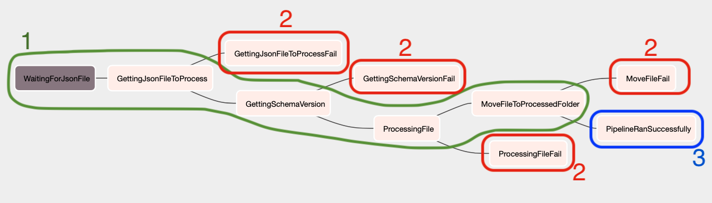

# MY AIRFLOW PROJECT
========

Hello guys, for this project run with the monitoring you need to create a bot and get your ID with the steps below. talking with [@BotFather](https://t.me/BotFather) or through QR Code below.

Follow this steps to create your bot correctly;

<table>
  <tr>
    <td></td>
    <td>
      <ol>
        <li>Send the message: <i>/newbot</i>
        <li>Choose the bot's name. You need to create a unique name with "bot" in the end. Eg: "JohnBot" or "john_bot".</li>
        <li>Choose the bot's user.</li>
        <li>Save the token.</li>
        </ol>
    </td>
  </tr>
  <tr>
    <td></td>
    <td>
      <ol>
        <li>Send any message to receive your infos.</li>
        <li>Take the <i>Id</i></li>. This ID is the person who will reseave the message.
        </ol>
    </td>
  </tr>
</table>

After you have the requirements above, let me explain for what they are used for.

The ___token___ is used for identify what bot will get the message.

The ___id___ is used for kwow who will get the message.

With the token and the id in hands, go to the `airflow_settings.yaml` and replace _Your bot token_ and _Your chat id_

In this simple tutorial, I had shown how to send the message for ourselves.

To test the bot you can use Python code below:

``` Python

import requests

token = 'your token'
chat_id = 'your chat id'

url = f'https://api.telegram.org/bot{token}/sendMessage'

message = 'Hello world!'

data = {'chat_id': chat_id, 'text': message}

requests.post(url, data=data)
```
---
# Videos

Here we can see the notifications working in case of failure and success.

## Success


## Fail

---

# The Pipeline


1. <span style="color:green">The main flow at the pipeline;</span>
2. <span style="color:red">Each red task will send a message with failure;</span>
3. <span style="color:DodgerBlue">The blue send a success message;</span>



The main flow is compound for:

1. __WaitingForJsonFile__: This is a _Sensor Operator_ responsible for monitoring if the folder has received a new file with the pattern *_employees_details.json;
2. __GettingJsonFileToProcess__: Python Operator in order to capture a single file for processing and continues the pipeline. If more than one file is loaded, this point ensures that only one file moves forward;
3. __GettingSchemaVersion__: A Python Operator retrieves last the schema version from the database and compares it with the schema version of the incoming file. If the schema versions are different, the schema file will be stored in Postgres and proceed with the processing of the file. If the schema versions are the same, the recording history is skipped and the file will be processed normally.
4. __ProcessingFile__: Processes the file to persist it in Postgres. If there is some difference between schemas, the adjustment will be made;
5. __MoveFileToProcessedFolder__: After processing, the file is moved from _include/data/new_ to _include/data/processed_ to keep the file history.

Overview
========

Welcome to Astronomer! This project was generated after you ran 'astro dev init' using the Astronomer CLI. This readme describes the contents of the project, as well as how to run Apache Airflow on your local machine.

Project Contents
================

Your Astro project contains the following files and folders:

- dags: This folder contains the Python files for your Airflow DAGs. By default, this directory includes an example DAG that runs every 30 minutes and simply prints the current date. It also includes an empty 'my_custom_function' that you can fill out to execute Python code.
- Dockerfile: This file contains a versioned Astro Runtime Docker image that provides a differentiated Airflow experience. If you want to execute other commands or overrides at runtime, specify them here.
- include: This folder contains any additional files that you want to include as part of your project. It is empty by default.
- packages.txt: Install OS-level packages needed for your project by adding them to this file. It is empty by default.
- requirements.txt: Install Python packages needed for your project by adding them to this file. It is empty by default.
- plugins: Add custom or community plugins for your project to this file. It is empty by default.
- airflow_settings.yaml: Use this local-only file to specify Airflow Connections, Variables, and Pools instead of entering them in the Airflow UI as you develop DAGs in this project.

Deploy Your Project Locally
===========================

1. Start Airflow on your local machine by running 'astro dev start'.

This command will spin up 3 Docker containers on your machine, each for a different Airflow component:

- Postgres: Airflow's Metadata Database
- Webserver: The Airflow component responsible for rendering the Airflow UI
- Scheduler: The Airflow component responsible for monitoring and triggering tasks

2. Verify that all 3 Docker containers were created by running 'docker ps'.

Note: Running 'astro dev start' will start your project with the Airflow Webserver exposed at port 8080 and Postgres exposed at port 5432. If you already have either of those ports allocated, you can either stop your existing Docker containers or change the port.

3. Access the Airflow UI for your local Airflow project. To do so, go to http://localhost:8080/ and log in with 'admin' for both your Username and Password.

You should also be able to access your Postgres Database at 'localhost:5432/postgres'.

Deploy Your Project to Astronomer
=================================

If you have an Astronomer account, pushing code to a Deployment on Astronomer is simple. For deploying instructions, refer to Astronomer documentation: https://docs.astronomer.io/cloud/deploy-code/

Contact
=======

The Astronomer CLI is maintained with love by the Astronomer team. To report a bug or suggest a change, reach out to our support team: https://support.astronomer.io/

---
